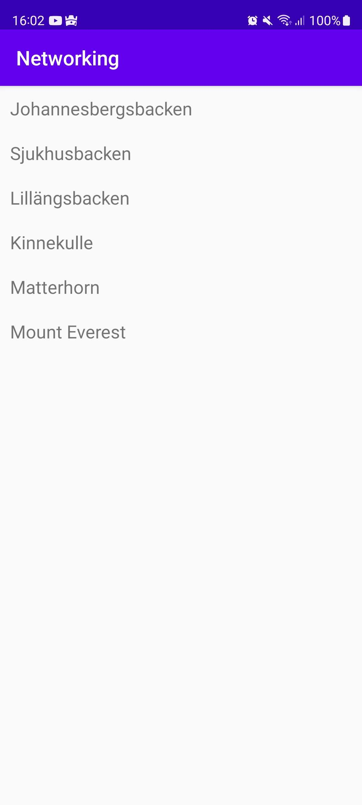

# Rapport

Jag har skapat en recyclerView som visar upp olika berg.
Den kan även uppdateras via adaptern och mer specifikt addAll funktionen som lägger till de nya
inlagda bergen från en JSON-lista som finns i en lokal fil.

Koden nedan är XML-koden för recyclerView som finns i filen activity_main.xml.
```
<androidx.recyclerview.widget.RecyclerView
        android:id="@+id/recycler_view"
        android:layout_width="match_parent"
        android:layout_height="match_parent"
        app:layout_constraintBottom_toBottomOf="parent"
        app:layout_constraintLeft_toLeftOf="parent"
        app:layout_constraintRight_toRightOf="parent"
        app:layout_constraintTop_toTopOf="parent" />
```

Kod från filen list_item.xml säger åt recyclerView hur datan ska visas upp.
```
<?xml version="1.0" encoding="utf-8"?>
<LinearLayout xmlns:android="http://schemas.android.com/apk/res/android"
    android:layout_width="match_parent"
    android:layout_height="wrap_content"
    android:orientation="horizontal"
    android:padding="10dp">

    <TextView
        android:id="@+id/title"
        android:layout_width="wrap_content"
        android:layout_height="wrap_content"
        android:textSize="18sp"/>

</LinearLayout>
```

Denna kod gör om namnen på objekten i JSON-listan så den kan visas upp korrekt. 
```
@Override
public String toString() {
    return "Mountain{" +
            "name='" + name + '\'' +
            '}';
}
```

Koden nedan hämtar alla objekt från JSON-listan och lägger till dem i bergslistan.
```
Type type = new TypeToken<ArrayList<Mountain>>() {}.getType();
ArrayList<Mountain> listOfMountains = gson.fromJson(json, type);
```

Detta är en metod för att uppdatera recyclerView med de nya objekten.
```
public void updateAdapter(ArrayList<Mountain> newItems){
    items.addAll(newItems);
}
```

Jag hämtade ingen JSON från hemsidan pågrund av firewall.

